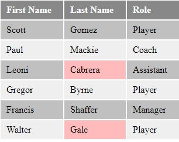

# Basic Data Exercises

## Exercise: Table 4

**Instructions**:

1.  Create a basic HTML page with all important elements using the provided files `index.html` and `main.css`
2.  Look at the mockup file and create the table shown using the `:first-child`, `:last-child`, `:nth-child` and `:not` pseudo classes.
3.  Apply background colors to the `<td>` elements
4.  Used colors are; `#c0c0c0`, `#888888`, `#efefef`, `#ffbbbb`
5.  Do NOT use deprecated HTML attributes. Style using CSS.

